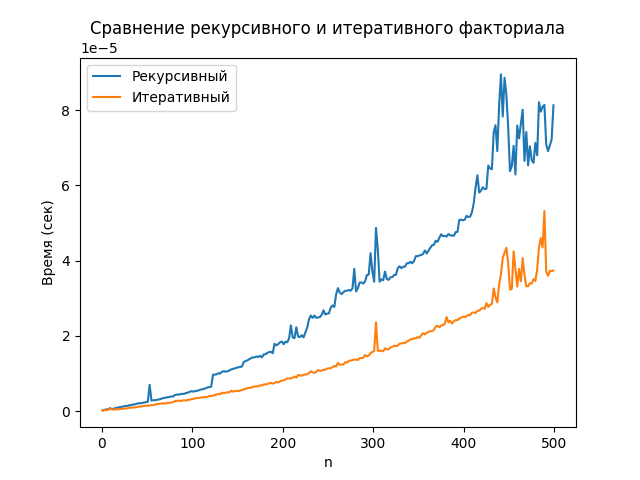
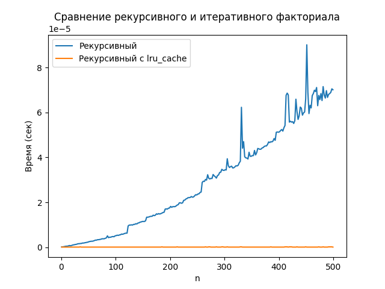
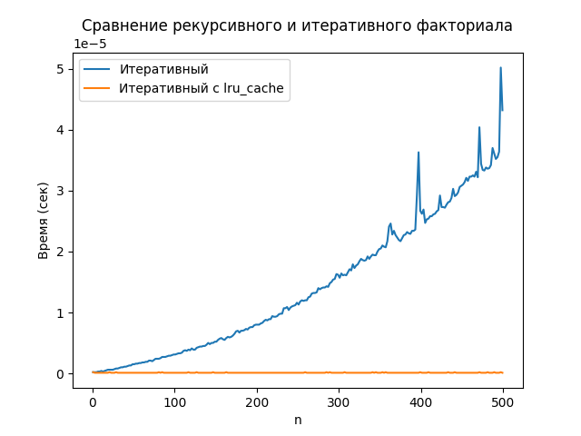

# ЛР4 — «Сравнение работы функций. Профайлинг»

**Автор:** Герасимов Михаил, <P3122>  
**Среда:** Python 3.13, timeit, matplotlib, unittest

## Навигация
- Сравнение рекурсивного и итеративного: [main.py](./main.py)
- Рекурсивный vs рекурсивный с `lru_cache`: [main1.py](./main1.py)
- Итеративный vs итеративный с `lru_cache`: [main2.py](./main2.py)
- Графики:  ·  · 

## Постановка задачи
Сравнить время работы двух реализаций вычисления факториала:
- рекурсивной `fact_recursive(n)`,
- нерекурсивной (итеративной) `fact_iterative(n)`,
а также исследовать влияние мемоизации (`functools.lru_cache`) на время выполнения.

Визуализировать зависимость времени от входного размера `n` (ось X — `n`, ось Y — время).

## Методика бенчмарка
- Генерируется **фиксированный набор** входных значений: `n in range(1, 500, 2)` (один и тот же для всех прогонов).
- Для каждого `n` выполняется **“чистый бенчмарк” одного вызова**: `timeit.repeat(..., number=1, repeat=5)` и берётся минимальное время среди повторов (минимизация шумов).
- Для наглядности строятся три графика: рекурсивный vs итеративный; рекурсивный vs рекурсивный с кэшем; итеративный vs итеративный с кэшем.

## Реализации
- Базовые функции: `fact_recursive(n)` и `fact_iterative(n)` — вычисляют факториал рекурсивно и в цикле соответственно. Реализация и построение общего графика находятся в файле `main.py`. 
- Эксперименты с кэшированием: версии с `@lru_cache` вынесены в `main1.py` (рекурсия) и `main2.py` (итеративная).

## Итоги наблюдений
- Итеративная реализация имеет более предсказуемое и обычно меньшее время выполнения на тех же `n` по сравнению с рекурсивной.
- Использование `lru_cache` приводит к резкому снижению времени **при повторных вызовах** для уже вычисленных `n`, что хорошо видно на отдельных графиках.

