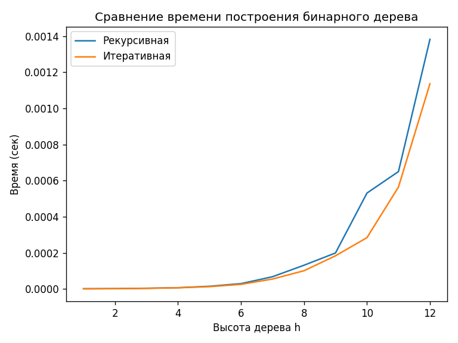

# ЛР6 — «Сравнение реализаций построения бинарного дерева» 

**Автор:** Герасимов Михаил, группа P3122, 
**Среда:** Python 3.13, timeit, matplotlib

## Навигация
- Код и бенчмарк: [main.py](./main.py)
- График: [график.png](./график.png)

## Постановка задачи
Сравнить время построения бинарного дерева для двух реализаций:
- `build_tree_recursive(h, r, lf, rf)` — рекурсивная;
- `build_tree_iterative(h, r, lf, rf)` — нерекурсивная (уровневой цикл).

Дерево хранится в словарях: `{"value": v, "left": {...}, "right": {...}}`.

## Вариант №4 (используется по умолчанию)
- `root = 4`, `height = 4`;
- формулы: `left = x*4`, `right = x+1`.

## Методика
- Фиксированный набор высот `h = 1..11`;
- «чистый» бенчмарк одного вызова: `timeit.repeat(..., number=1, repeat=5)`, берётся минимум;
- при запуске скрипта строится график (X — высота, Y — время).

## Результаты (график)

**Что видно:**
- Итеративная реализация быстрее рекурсивной на всём диапазоне `h`.
- Замеры: `timeit`, один вызов (`number=1`), несколько повторов (`repeat=5`), взят минимум.

## Короткий вывод
- Итеративная версия обычно быстрее из-за отсутствия накладных расходов вызовов функции.