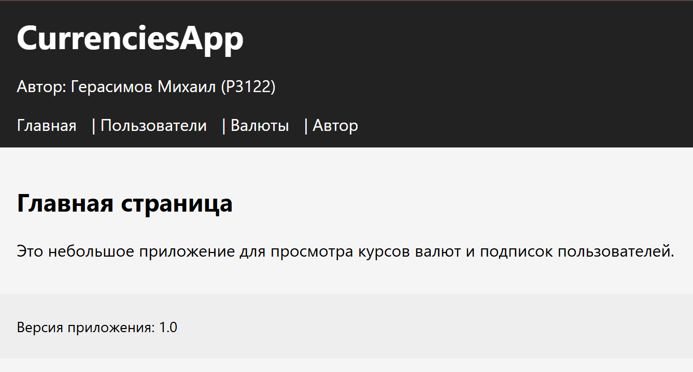
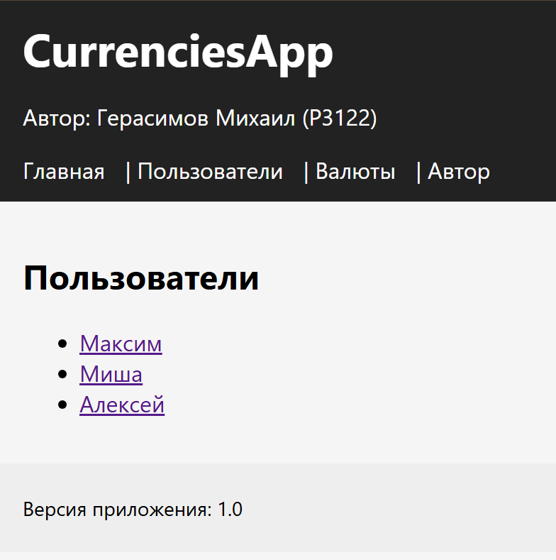
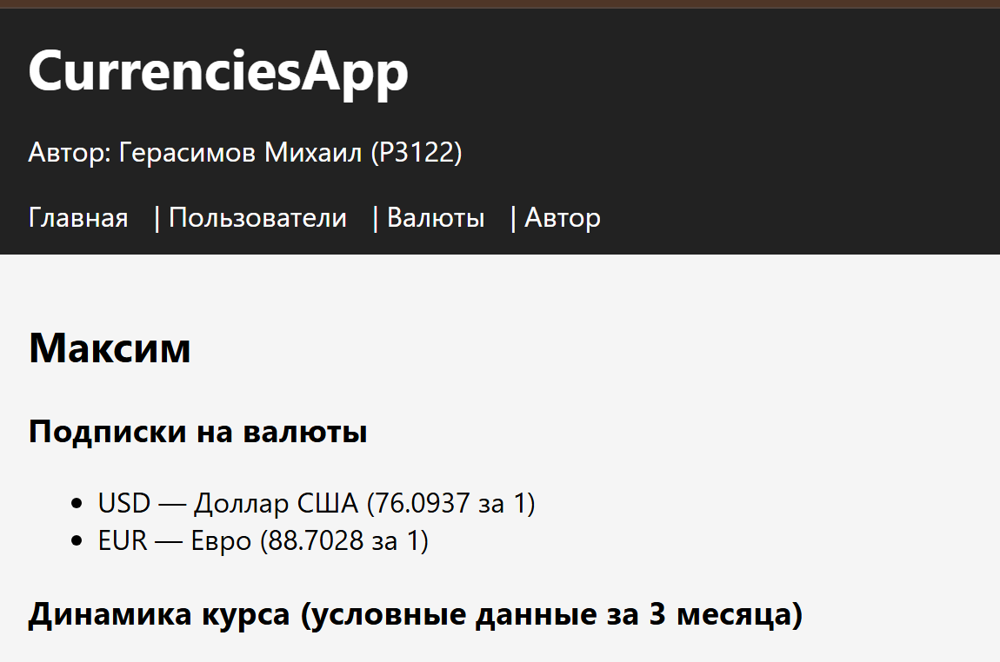
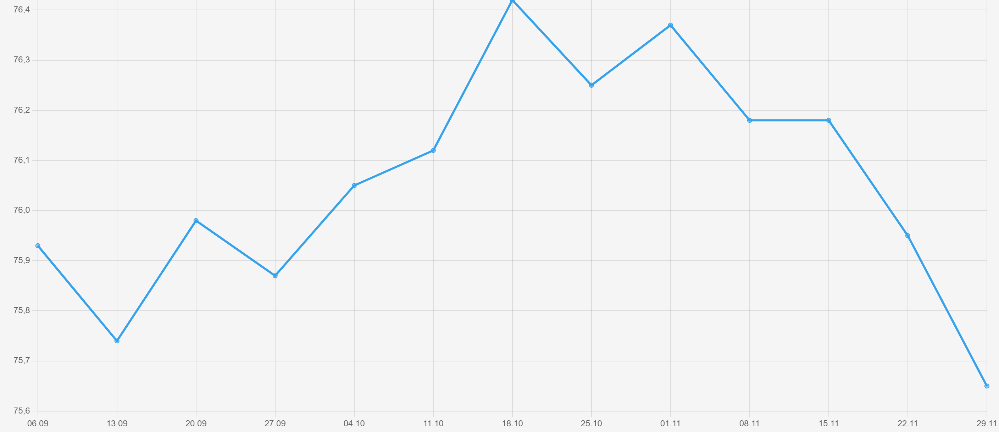
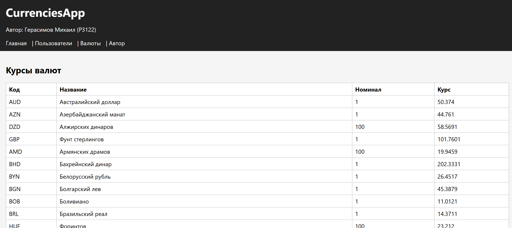
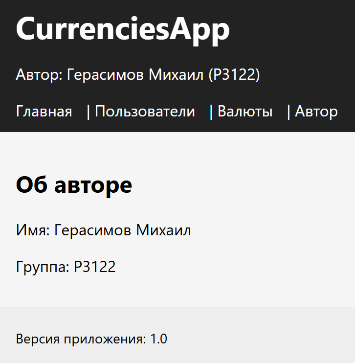

# Отчёт по лабораторной работе №8
## Тема: Простое клиент-серверное приложение на Python

**Дисциплина:** Программирование на Python  
**Студент:** Герасимов Михаил  
**Группа:** P3122  

---

## 1. Цель работы

Цель лабораторной работы — разработать простое клиент-серверное приложение на Python без использования веб-фреймворков, организованное по архитектуре MVC, с использованием:

- стандартного модуля `http.server` (`HTTPServer`, `BaseHTTPRequestHandler`);
- шаблонизатора Jinja2 для формирования HTML-страниц;
- отдельного модуля для получения курсов валют с сайта ЦБ РФ;
- собственных моделей предметной области (Author, App, User, Currency, UserCurrency);
- простой системы подписок пользователей на валюты и отображением динамики курсов.

---

## 2. Задание

1. Реализовать модели предметной области:
   - Author, App, User, Currency, UserCurrency.
   - Для каждого свойства реализовать геттеры и сеттеры с проверкой типов и корректности значений.
2. Реализовать HTTP-сервер на базе `HTTPServer` и `BaseHTTPRequestHandler`.
3. Настроить маршруты:
   - `/` — главная страница с информацией о приложении и авторе;
   - `/users` — список пользователей;
   - `/user?id=...` — информация о конкретном пользователе и его подписках;
   - `/currencies` — список валют с текущими курсами;
   - `/author` — информация об авторе.
4. Использовать шаблоны Jinja2 для отображения данных. Хранить шаблоны в папке `templates/`.
5. Реализовать модуль `utils/currencies_api.py` с функцией `get_currencies()`, получающей актуальные курсы валют с сайта ЦБ РФ.
6. Реализовать на странице пользователя отображение динамики курсов валют, на которые он подписан (графики за условные 3 месяца).
7. Написать простые тесты для моделей и функции `get_currencies()`.

---

## 3. Описание предметной области и моделей

Все модели находятся в пакете `myapp.models`.

### 3.1. Модель Author

Файл: `myapp/models/author.py`  

Содержит информацию об авторе приложения.

Свойства:

- `name: str` — имя автора;
- `group: str` — учебная группа.

Реализованы геттеры и сеттеры с проверкой:

- значение — строка;
- строка не пустая.

### 3.2. Модель App

Файл: `myapp/models/app.py`  

Описывает приложение.

Свойства:

- `name: str` — название приложения;
- `version: str` — версия;
- `author: Author` — объект автора.

Проверки:

- `name`, `version` — непустые строки;
- `author` — экземпляр класса `Author`.

### 3.3. Модель User

Файл: `myapp/models/user.py`  

Свойства:

- `id: int` — целочисленный идентификатор пользователя;
- `name: str` — имя пользователя.

Проверки:

- `id` — целое число > 0;
- `name` — непустая строка.

### 3.4. Модель Currency

Файл: `myapp/models/currency.py`  

Описывает валюту, полученную из XML ЦБ РФ.

Свойства:

- `id: str` — строковый идентификатор валюты (атрибут `ID` в `<Valute>`);
- `num_code: int` — цифровой код;
- `char_code: str` — символьный код (например, USD, EUR);
- `name: str` — название валюты;
- `value: float` — курс;
- `nominal: int` — номинал.

Проверки:

- текстовые поля — строки и не пустые;
- `num_code`, `nominal` — целые числа > 0;
- `value` — положительное число.

### 3.5. Модель UserCurrency

Файл: `myapp/models/user_currency.py`  

Определяет связь «многие ко многим» между пользователями и валютами.

Свойства:

- `id: int` — идентификатор записи;
- `user_id: int` — внешний ключ на `User`;
- `currency_id: str` — внешний ключ на `Currency`.

Проверки:

- `id`, `user_id` — целые числа > 0;
- `currency_id` — непустая строка.

---

## 4. Структура проекта

Проект организован в виде пакета `myapp`:

```text
myapp/
  __init__.py
  myapp.py          
  models/
    __init__.py
    author.py
    app.py
    user.py
    currency.py
    user_currency.py
  utils/
    __init__.py
    currencies_api.py
  templates/
    base.html
    index.html
    users.html
    user.html
    currencies.html
    author.html
  static/
    style.css
tests.py            
```

- **Models** — файлы в `myapp/models/`, реализующие классы предметной области.
- **Views** — Jinja2-шаблоны в `myapp/templates/` (HTML-структура страниц).
- **Controller** — файл `myapp/myapp.py`, в котором реализованы маршрутизация и обработка запросов.

---

## 5. Реализация контроллера и маршрутов

### 5.1. Запуск сервера

Сервер реализован на базе `HTTPServer` и `BaseHTTPRequestHandler`:

После запуска сервер доступен по адресу:  
`http://127.0.0.1:8000/`.

### 5.2. Маршрутизация

Основной обработчик запросов — класс `SimpleHandler`, наследующий `BaseHTTPRequestHandler`.

В методе `do_GET` обрабатываются пути:

- `/` — главная страница (метод `handle_index`);
- `/users` — список пользователей (`handle_users`);
- `/user?id=...` — информация о пользователе и его подписках (`handle_user`);
- `/currencies` — таблица курсов валют (`handle_currencies`);
- `/author` — информация об авторе (`handle_author`);
- `/static/style.css` — раздача файла стилей (`handle_static`).

При неизвестном пути возвращается ошибка 404.

### 5.3. Пример обработчика

Пример обработчика главной страницы:


---

## 6. Работа с API курсов валют

Файл: `myapp/utils/currencies_api.py`  

Функция `get_currencies()` выполняет:

1. HTTP-запрос к ЦБ РФ:

   ```python
   CBR_URL = "https://www.cbr.ru/scripts/XML_daily.asp"
   response = requests.get(CBR_URL, timeout=5)
   response.raise_for_status()
   ```
---

## 7. Подписки пользователей и графики динамики курса

### 7.1. Подписки

Данные о пользователях и подписках задаются в контроллере:

```python
users = [
    User(user_id=1, name="Максим"),
    User(user_id=2, name="Миша"),
    User(user_id=3, name="Алексей"),
]

subscriptions = [
    UserCurrency(record_id=1, user_id=1, currency_id="R01235"),  # USD
    UserCurrency(record_id=2, user_id=1, currency_id="R01239"),  # EUR
    UserCurrency(record_id=3, user_id=2, currency_id="R01235"),  # USD
    UserCurrency(record_id=4, user_id=3, currency_id="R01010"),  # другая валюта
]
```

Для страницы `/user?id=...`:

- по `id` ищется объект `User`;
- из списка всех валют, полученных через `get_currencies()`, выбираются те, на которые пользователь подписан.

### 7.2. Построение истории курса

Для каждой валюты строится условная история курса за 3 месяца

Эти данные передаются в шаблон `user.html` в виде списка словарей `charts`.

### 7.3. Отображение графиков (Chart.js)

В шаблоне `user.html` подключается библиотека Chart.js (по CDN) и для каждой подписанной валюты создаётся отдельный `<canvas>`:

```html

    <h4>{{ chart.char }}</h4>
    <canvas id="c{{ loop.index }}"></canvas>

```

Инициализация графиков выполняется на стороне клиента (JavaScript):

```html
<script src="https://cdn.jsdelivr.net/npm/chart.js"></script>
<script>
    const chartData = {{ charts | tojson }};
    chartData.forEach((item, index) => {
        new Chart(document.getElementById("c" + (index + 1)), {
            type: "line",
            data: {
                labels: item.labels,
                datasets: [{
                    label: item.char,
                    data: item.values
                }]
            }
        });
    });
</script>
```

Таким образом выполняется требуемая по заданию визуализация динамики курса валют.

---

## 9. Тестирование

Для тестирования используется модуль `unittest`. Все тесты находятся в файле `tests.py` на уровне корня проекта.

Проверяется:

1. Корректная работа моделей:
   - создание объектов `Author`, `User`, `Currency`, `UserCurrency`;
   - выброс исключений при неверных данных (например, отрицательный `id` или `value`).

2. Работа функции `get_currencies()`:
   - при доступности API должен возвращаться список объектов `Currency`;
   - при недоступности API тест помечается как пропущенный (skip), а не падает с ошибкой.

---

## 10. Примеры работы приложения

После запуска сервера доступны следующие страницы:

- `http://127.0.0.1:8000/` — главная страница;



- `http://127.0.0.1:8000/users` — список пользователей;


- `http://127.0.0.1:8000/user?id=1` — информация о пользователе №1 (Максим), его подписках и графиках;



- `http://127.0.0.1:8000/currencies` — таблица всех загруженных курсов валют;


- `http://127.0.0.1:8000/author` — информация об авторе (Герасимов Михаил, P3122).

---

## 11. Выводы

В ходе выполнения лабораторной работы было разработано простое клиент-серверное приложение на Python, реализованное по архитектуре MVC. Были созданы модели предметной области с геттерами и сеттерами, настроен HTTP-сервер на основе стандартной библиотеки, подключён шаблонизатор Jinja2, реализовано получение данных о курсах валют с сайта ЦБ РФ и их отображение в виде таблиц и графиков. Дополнительно были написаны тесты для моделей и функции `get_currencies()`.

Поставленные цели лабораторной работы достигнуты, задание выполнено.
