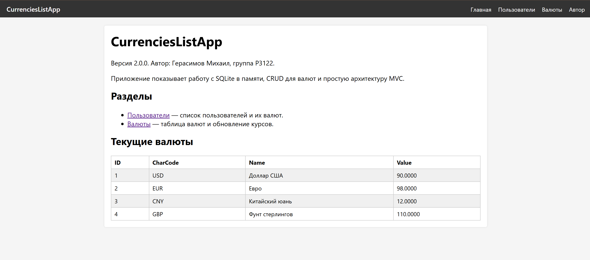
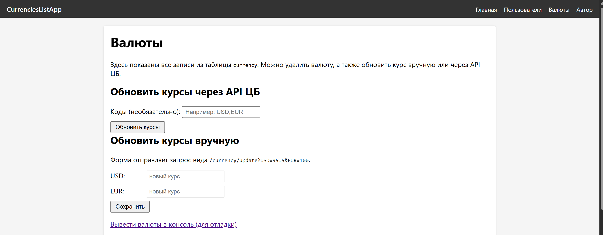
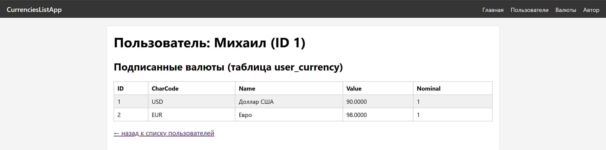

# Лабораторная работа №9
**Тема:** CRUD, SQLite (:memory:) и архитектура MVC для веб‑приложения на Python

## 1. Цель работы

1. Реализовать операции CRUD (Create, Read, Update, Delete) для сущности `Currency`.
2. Освоить работу с базой данных SQLite в памяти (`sqlite3.connect(':memory:')`).
3. Закрепить использование первичных и внешних ключей и понять их роль в связях таблиц.
4. Организовать код по архитектуре MVC:
   - **Models** – описание сущностей и их свойств;
   - **Controllers** – бизнес‑логика и работа с БД;
   - **Views** – HTML‑шаблоны с использованием Jinja2.
5. Использовать простой HTTP‑сервер на базе стандартного модуля `http.server` и реализовать маршрутизацию по `GET`‑запросам.
6. Написать модульные тесты с использованием `unittest` и `unittest.mock` на примере сущности `currency`.

---

## 2. Описание моделей и связей

В приложении используются три основные таблицы базы данных и логические сущности: пользователь, валюта и подписка пользователя на валюту.

### 2.1. Таблица `user`

```sql
CREATE TABLE user (
    id INTEGER PRIMARY KEY AUTOINCREMENT,
    name TEXT NOT NULL
);
```

* `id` – первичный ключ пользователя;
* `name` – имя пользователя.

### 2.2. Таблица `currency`

```sql
CREATE TABLE currency (
    id INTEGER PRIMARY KEY AUTOINCREMENT,
    num_code TEXT NOT NULL,
    char_code TEXT NOT NULL,
    name TEXT NOT NULL,
    value FLOAT,
    nominal INTEGER
);
```

* `id` – первичный ключ валюты;
* `num_code` – числовой код валюты (например, `840` для USD);
* `char_code` – символьный код валюты (например, `USD`);
* `name` – название валюты;
* `value` – курс валюты (стоимость `nominal` единиц в рублях);
* `nominal` – номинал (обычно `1`).

### 2.3. Таблица `user_currency`

```sql
CREATE TABLE user_currency (
    id INTEGER PRIMARY KEY AUTOINCREMENT,
    user_id INTEGER NOT NULL,
    currency_id INTEGER NOT NULL,
    FOREIGN KEY(user_id) REFERENCES user(id),
    FOREIGN KEY(currency_id) REFERENCES currency(id)
);
```

* `id` – первичный ключ записи связи;
* `user_id` – внешний ключ на таблицу `user`;
* `currency_id` – внешний ключ на таблицу `currency`.

### 2.4. Роль первичных и внешних ключей

* **Первичный ключ (PRIMARY KEY)** однозначно определяет запись в таблице и используется для связей между таблицами.
* **Внешний ключ (FOREIGN KEY)** задаёт связь между таблицами и помогает поддерживать целостность данных. Например, невозможно создать запись в `user_currency` с несуществующим пользователем или валютой при включённой проверке внешних ключей.

---

## 3. Структура проекта

Проект оформлен как пакет `myapp` и разделён по слоям MVC.

```text
LR9/
│
├─ myapp/
│  ├─ __init__.py
│  ├─ myapp.py                # Точка входа, HTTP‑сервер, маршрутизация
│  ├─ pages.py                # Рендеринг страниц через Jinja2
│  │
│  ├─ controllers/
│  │  ├─ __init__.py
│  │  ├─ databasecontroller.py  # Работа с SQLite, создание схемы, CRUD
│  │  ├─ currencycontroller.py 
│  │  └─ usercontroller.py      
│  │
│  ├─ models/
│  │  ├─ __init__.py
│  │  ├─ app.py               # Модель приложения
│  │  ├─ author.py            # Модель автора
│  │  ├─ user.py              # Модель пользователя
│  │  └─ currency.py          # Модель валюты
│  │
│  ├─ templates/
│  │  ├─ base.html            # Базовый шаблон
│  │  ├─ index.html           # Главная страница
│  │  ├─ author.html          # Информация об авторе
│  │  ├─ users.html           # Список пользователей
│  │  ├─ user.html            # Один пользователь и его валюты
│  │  └─ currencies.html      # Список валют и действия с ними
│  │
│  ├─ static/
│  │  └─ style.css            # Простой CSS‑стиль оформления с помощью ИИ
│  │
│  └─ utils/
│     └─ currencies_api.py    # Получение курсов валют из API ЦБ РФ
│
├─ tests.py                   # Тесты
└─ README.md                  # Отчёт по лабораторной работе
```

Слой Models содержит только свойства сущностей и простую валидацию.  
Слой Controllers обращается к базе данных и подготавливает данные для шаблонов.  
Слой Views реализован в виде HTML‑шаблонов Jinja2 и отвечает только за отображение.

---

## 4. Реализация CRUD для таблицы `currency`

Все операции с таблицей `currency` реализованы в классе `DatabaseController` (файл `controllers/databasecontroller.py`). Для всех запросов используются параметризованные выражения, что защищает от SQL‑инъекций.

### 4.1. Create — добавление записей

```python
def currency_create_many(self, data: Iterable[Dict[str, Any]]) -> None:
    sql = """
        INSERT INTO currency(num_code, char_code, name, value, nominal)
        VALUES (:num_code, :char_code, :name, :value, :nominal)
    """
    self.conn.executemany(sql, data)
    self.conn.commit()
```

Пример списка данных:

```python
currencies = [
    {"num_code": "840", "char_code": "USD", "name": "Доллар США", "value": 90.0, "nominal": 1},
    {"num_code": "978", "char_code": "EUR", "name": "Евро", "value": 98.0, "nominal": 1},
]
db.currency_create_many(currencies)
```

### 4.2. Read — чтение записей

```python
def currency_read_all(self) -> List[sqlite3.Row]:
    cur = self.conn.cursor()
    cur.execute("SELECT * FROM currency ORDER BY id")
    return cur.fetchall()
```

Контроллер `CurrencyController.list_currencies()` преобразует полученные строки в словари и передаёт их слою представления для отображения в шаблонах.

### 4.3. Update — изменение курса валюты

```python
def currency_update_values(self, updates: Dict[str, float]) -> None:
    sql = "UPDATE currency SET value = ? WHERE char_code = ?"
    cur = self.conn.cursor()
    for code, value in updates.items():
        cur.execute(sql, (value, code.upper()))
    self.conn.commit()
```

Значения подставляются через параметры `?`, а не напрямую в строку SQL, поэтому запрос безопасен относительно SQL‑инъекций.

### 4.4. Delete — удаление валюты

```python
def currency_delete(self, currency_id: int) -> None:
    cur = self.conn.cursor()
    cur.execute("DELETE FROM user_currency WHERE currency_id = ?", (currency_id,))
    cur.execute("DELETE FROM currency WHERE id = ?", (currency_id,))
    self.conn.commit()
```

При удалении валюты сначала удаляются записи в таблице `user_currency`, затем сама валюта.

---

## 5. Обновление курсов через API ЦБ РФ

Актуальные курсы валют получаются с помощью функции `get_currencies` из модуля `utils/currencies_api.py`. На основе данных из API обновляются записи в таблице `currency`.

Метод в `DatabaseController`:

```python
def sync_currencies_with_cbr(self, codes: Iterable[str] | None = None) -> None:
    currencies = get_currencies(codes)

    cur = self.conn.cursor()
    cur.execute("SELECT id, char_code FROM currency")
    existing = {row["char_code"]: row["id"] for row in cur.fetchall()}

    for c in currencies:
        if c.char_code in existing:
            cur.execute(
                """
                UPDATE currency
                SET num_code = ?, name = ?, value = ?, nominal = ?
                WHERE char_code = ?
                """,
                (c.num_code, c.name, c.value, c.nominal, c.char_code),
            )
        else:
            cur.execute(
                """
                INSERT INTO currency(num_code, char_code, name, value, nominal)
                VALUES (?, ?, ?, ?, ?)
                """,
                (c.num_code, c.char_code, c.name, c.value, c.nominal),
            )

    self.conn.commit()
```
---

## 6. Маршруты приложения и шаблоны

Основной класс HTTP‑обработчика определён в файле `myapp/myapp.py`. Ниже приведена таблица маршрутов и используемых шаблонов.

| Маршрут                     | Описание                                       | Шаблон          |
|-----------------------------|------------------------------------------------|-----------------|
| `/`                         | Главная страница                               | `index.html`    |
| `/author`                   | Информация об авторе                           | `author.html`   |
| `/users`                    | Список пользователей                           | `users.html`    |
| `/user?id=...`              | Один пользователь и его валюты                | `user.html`     |
| `/currencies`               | Список всех валют                              | `currencies.html`|
| `/currencies/refresh`       | Обновление курсов через API ЦБ РФ             |  —  |
| `/currency/delete?id=...`   | Удаление валюты по идентификатору             |  —    |
| `/currency/update?USD=...`  | Обновление курса одной или нескольких валют   |   —  |
| `/currency/show`            | Вывод списка валют в консоль (для проверки)   | —      |
| `/static/style.css`         | Статический CSS‑файл                           | —               |

---

## 7. Скриншоты работы приложения

* главная страница;

* список валют и формы обновления;


* страница пользователя и его валют.


Скриншоты демонстрируют:

* отображение данных из таблиц `user` и `currency`;
* работу удаления и обновления записей;
* обновление курсов через API.

---

## 8. Выводы

В ходе выполнения лабораторной работы было реализовано веб‑приложение с архитектурой MVC, использующее базу данных SQLite в памяти. Для сущности `Currency` выполнен полный набор операций CRUD с применением параметризованных SQL‑запросов. Добавлено обновление курсов через API ЦБ РФ и организована маршрутизация HTTP‑запросов.

Также были написаны модульные тесты с использованием `unittest`, что показало, как можно проверять корректность работы контроллеров без обращения к реальной базе данных. Цели лабораторной работы выполнены.
